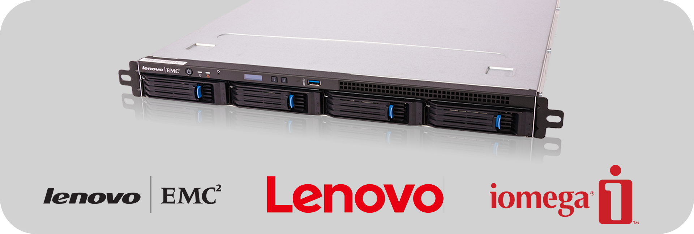
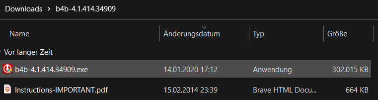
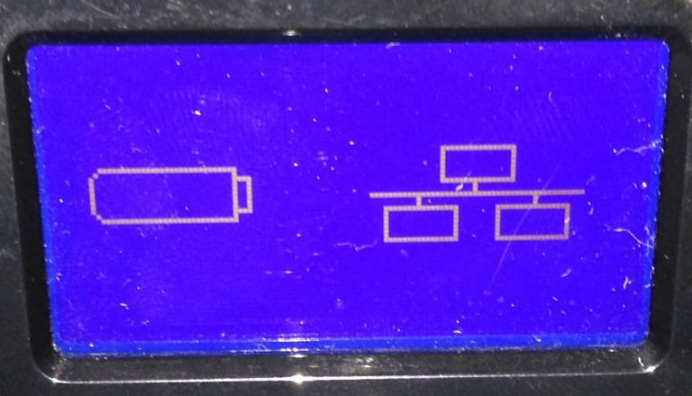

<div align="center">

# Lenovo NAS reflash

This repository contains information about Lenovo NAS devices. Specifically, information on how to reflash the firmware on these devices.



</div>

## Table of Contents

- [Lenovo LifeLine Imager download](#lenovo-lifeline-imager-download)
  - [What is the Lenovo LifeLine Imager](#what-is-the-lenovo-lifeline-imager)
  - [How to download the Lenovo LifeLine Imager?](#how-to-download-the-lenovo-lifeline-imager)
  - [Table of known Lenovo LifeLine Imager downloads](#table-of-known-lenovo-lifeline-imager-downloads)
    - [LenovoEMC](#lenovoemc)
    - [Lenovo](#lenovo)
    - [Iomega (StorCenter)](#iomega-storcenter)
- [How to flash the firmware](#how-to-flash-the-firmware)
- [Resources](#resources)

## Lenovo LifeLine Imager download

#### What is the Lenovo LifeLine Imager?

The Lenovo LifeLine Imager is a tool that can create a bootable USB drive that can be used to reflash the firmware on LenovoEMC² NAS devices.

#### How to download the Lenovo LifeLine Imager?

Thanks to a comment under [this post](https://www.petenetlive.com/KB/Article/0001381), here is a guide on how to "construct" the download link for the Lenovo LifeLine Imager, specific to your device.

1. Go to the [LenovoEMC² Support Page](https://download.lenovo.com/lenovoemc/na/en/index.html).
2. Find your device in the list and open the support page for it.
3. Under `DOWNLOADS AND UPDATES` click on `Firmware Version x.x.x.x for XXXX`.
4. Scroll down to `Update Instructions -> Firmware Update Procedure` and take note of the first step of the instructions.
5. The step should be something like `Download the b4b-4.1.414.34909.tgz file to your computer.`
6. Take note of the filename of the `.tgz` file. (But without the `.tgz` extension!!!)
7. Construct the download link as follows: `https://download.lenovo.com/nasupdate/asgimage/ + filename + .zip` and open it in your browser.
8. You should now be able to download the Lenovo LifeLine Imager, specific to your device and firmware version.
9. The downloaded content should look like this, after extracting the `.zip` file:

<div align="center">



</div>

### Table of known Lenovo LifeLine Imager downloads

Feel free to add your device and firmware version to the table below using a PR.

<div align="center">

#### LenovoEMC

| Device | Firmware Version | Download Link | Note | Version |
| ------ | ---------------- | ------------- | ----- | ------- |
| PX4-400R | 4.1.414.34909 | [Download](https://download.lenovo.com/nasupdate/asgimage/b4b-4.1.414.34909.zip) | Same for PX4-400D | Rack |
| PX4-300R | 4.1.414.34909 | [Download](https://download.lenovo.com/nasupdate/asgimage/px4-300r-4.1.414.34909.zip) | | Rack |
| PX12-400R | 4.1.414.34909 | [Download](https://download.lenovo.com/nasupdate/asgimage/r12b-4.1.414.34909.zip) | Same for PX12-450R | Rack |
| PX4-300D | 4.1.414.34909 | [Download](https://download.lenovo.com/nasupdate/asgimage/px4px6-4.1.414.34909.zip) | Same for PX6-300D | Desktop |
| PX2-300D | 4.1.414.34909 | [Download](https://download.lenovo.com/nasupdate/asgimage/b2a-4.1.414.34909.zip) | | Desktop |

#### Lenovo

| Device | Firmware Version | Download Link | Note | Version |
| ------ | ---------------- | ------------- | ----- | ------- |
| IX4-300D | 4.1.414.34909 | [Download](https://download.lenovo.com/nasupdate/asgimage/h4c-4.1.414.34909.zip) |  | Desktop |
| IX2 | 4.1.408.34845 | [Download](https://download.lenovo.com/nasupdate/asgimage/ix2-ng-4.1.408.34845.zip) | Same for IX2-DL | Desktop |

#### Iomega (StorCenter)

| Device | Firmware Version | Download Link | Note | Version |
| ------ | ---------------- | ------------- | ----- | ------- |
| ALL | 4.1.414.34909 | | The download links for the StorCenter devices are the same as for the LenovoEMC² devices | Both |

</div>

## How to flash the firmware

> [!CAUTION]
> Remove your hard drives before flashing the firmware to prevent data loss! During the flashing process, all connected hard drives will be formatted!

1. Format a USB drive to FAT32. (Needs to be at least 1GB in size, maximum 32GB)
2. Unzip the downloaded Imager file and run the executable file contained within.
3. When prompted, select the USB drive as the destination.
4. Reboot the NAS with the USB drive inserted (in the **top left** port on the backside of the device) **and** hold the reset button for 60 seconds.
5. You should now see this screen:

<div align="center">



</div>

6. When finished, the device should shut down, simply power it back on.
7. The device should now boot back up and be ready to be reconfigured.

## Additional Information

- The Lenovo LifeLine Imager is a Windows-only tool.
- The used USB needs to be formatted as FAT32! Otherwise, the NAS won't recognize it.
- If the Imager tool doesn't recognize the USB drive, try using rufus to reformat the USB drive. Select the drive, then the `Non-bootable` option, and select `FAT32` as the file system. Then click `Start`.
- Sometimes the USB creator tool doesn't properly move the firmware files to the USB. If you encounter issues, try rerunning the tool or manually moving the files to the USB by following the USB file structure below.

### USB file structure

> [!NOTE]
> The file under `b4b_images` is the actual firmware file. The other files are used for the boot process. This file could be manually replaced, in case the Imager tool doesn't create the USB drive properly.

The USB drive should have the following structure after running the Imager tool:

```plaintext
USB-DRIVE:.
├───boot
│   └───grub
│       ├───locale
|       └───...
├───images
│   └───...
└───emctools
    └───b4b_images
        └───VERSION_Imager.tgz
```

## Background Information

I own an LenovoEMC² PX4-400R NAS that I got from ebay. Sadly during resetting the device, I bricked it. I was **not** able to recover it yet. But after lots of research, I found some forum posts that might help you recover your device, if you ever find yourself in a similar situation. I decided to create this repository to help others in the future.

## Resources

> [!NOTE]
> Links marked with ❗ are the most important ones.

❗[PX4-300D Lenovo EMC NAS Device Stuck at 95%](https://www.petenetlive.com/KB/Article/0001381)

[Help for old Lenovo EMC NAS units, IX2, PX4 etc](https://forums.anandtech.com/threads/help-for-old-lenovo-emc-nas-units-ix2-px4-etc.2609187/)

## Contributing

Contributions to this repository are very welcome! Here's how you can help:

1. **Fork** this repository.
2. **Create a new branch** on your forked repository.
3. **Make your changes**. This could be adding a new device to the table, updating a download link, or improving the instructions.
4. **Submit a pull request**. Make sure to describe your changes in detail.

If you have any questions or need help, feel free to open an issue.

## Disclaimer

Flashing firmware is a potentially risky operation. If done incorrectly, it can result in a bricked device. Please follow the instructions carefully and understand the risks involved. The author of this repository is not responsible for any damage caused by following these instructions.
